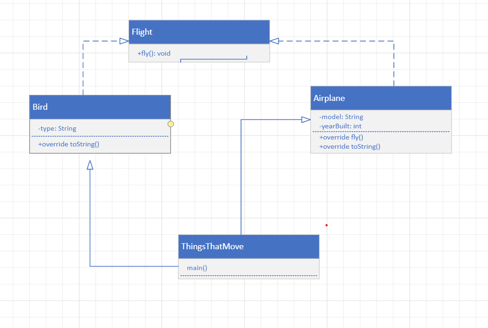
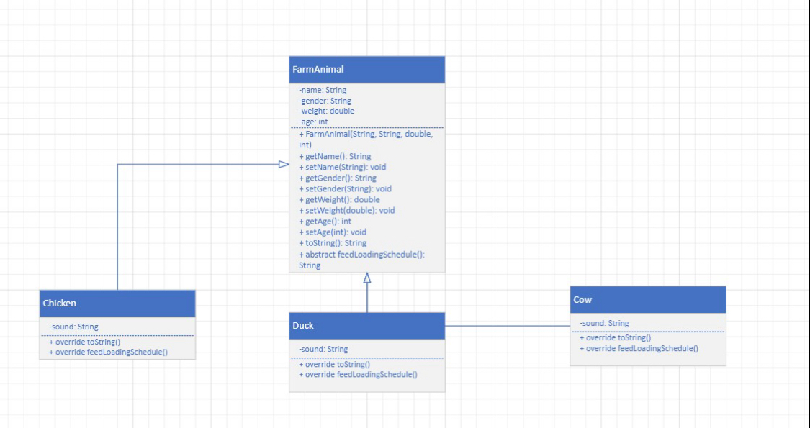
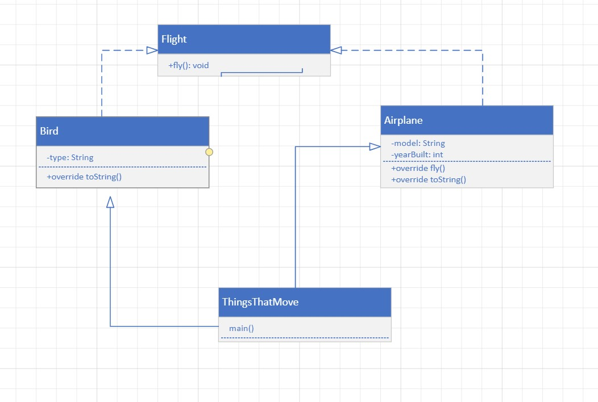

/**Class: README.md
* @author Tee Willie
* @version 1.0
* Course: ITEC 3200
* Written:March 9, 2024
*
* This class is a read me file.
  */
  
* READ ME TEXTS FOR CHAPTER 3 HW QUESTIONS 1-3
UMLS 

Exercise 1:

Program Description:
- Define a superclass `FarmAnimal` with attributes: name, gender, weight, and age.
- Implement subclasses `Chicken`, `Cow`, and `Duck`.
- Each subclass has a sound attribute and overrides methods like `toString` and `feedLoadingSchedule`.
- Write an application called `MyFarm` to create objects of different animals, display their information and feeding schedules.

Reference Information:
- Interface and abstract class usage: Learn about creating and implementing interfaces, and extending abstract classes.
- Inheritance and method overriding: Understand how subclasses inherit behavior from superclasses and override methods.
- Array or ArrayList implementation: Learn to create and manipulate arrays or ArrayLists to store objects.
- Object-oriented principles: Understand encapsulation, inheritance, polymorphism, and abstraction in object-oriented programming.

**Websites for Help:**
1. GeeksforGeeks - https://www.geeksforgeeks.org/java/
2. Oracle Java Documentation - https://docs.oracle.com/javase/tutorial/
3. Tutorialspoint - https://www.tutorialspoint.com/java/index.htm

Exercise 2:

Program Description:
- Define an interface `Flight` with a method `fly()`.
- Implement classes `Airplane` and `Bird` which implement the `Flight` interface.
- Each class has specific flying behavior defined in the `fly()` method.
- Create objects of `Airplane` and `Bird` and store them in an array or ArrayList.

Reference Information:
- Interface usage: Learn about defining and implementing interfaces in Java.
- Polymorphism and method overriding: Understand how different objects can be treated interchangeably through interfaces.
- Object-oriented design principles: Understand how interfaces promote loose coupling and high cohesion.

**Websites for Help:**
1. Baeldung - https://www.baeldung.com/java-interfaces
2. JavaPoint - https://www.javatpoint.com/java-interfaces
3. W3Schools - https://www.w3schools.com/java/java_interface.asp

Exercise 3:

Program Description:
- Extend Exercise 2 by defining another interface `Movement` that extends `Flight`.
- `Movement` interface contains abstract methods `walk()` and `jump()`.
- Implement `Movement` interface in `Airplane` and `Bird` classes.
- Create objects and store them in an array or ArrayList.

Reference Information:
- Interface inheritance: Learn how interfaces can extend other interfaces.
- Abstract method implementation: Understand how to implement methods declared in an interface.
- Polymorphism and object-oriented design: Understand how interfaces can provide a contract for different classes to adhere to.

**Websites for Help:**
1. JournalDev - https://www.journaldev.com/16097/interface-in-java
2. Tutorialspoint - https://www.tutorialspoint.com/java/java_interfaces.htm
3. Java Code Geeks - https://www.javacodegeeks.com/2013/05/java-interface-tutorial-with-examples.html

